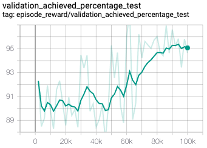
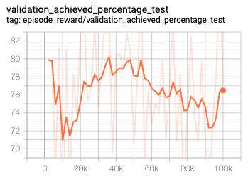

# Combining DRLinda with Lan et al.'s approach to support multi-attribute indexes

We have attempted to combine DRLinda with the approach of Lan et al. (see referenced publications in repository's main README file). However, our experiments were not successful, resulting in degraded or not improved performance. During training, the agent does not converge, or it results in degraded performance compared to the standard DRLinda approach, see *Tensorboard figures* below. This behavior might be due to incompatible state representations, i.e., attribute-based for DRLinda and index candidate-based for Lan et al.

The experiment's source will be added to a dedicated branch. The corresponding classes are `DRLindaActionManagerMultiAttribute` in *action_manager.py*, `DRLindaObservationManagerMultiAttribute` in *observation_manager.py*. We have statically determined the index candidates (visible in *experiment.py*) via Lan et al.'s multi-attribute index heuristics. (To support other benchmarks than TPC-H, we had to adjust Lan et al.'s parser code slightly, the patch file can be found under [./parser_lan_et_al.patch](./parser_lan_et_al.patch)). The resulting index candidates for TPC-H, TPC-DS, and JOB are integrated into *experiment.py* and must be enabled on demand.

### Tensorboard figures

The following figures show the achieved performance of the combined approach on the test set during and after training.

TPC-H, (*single-attribute* DRLinda reference 82.6):

TPC-DS, (*single-attribute* DRLinda reference 91.5):

JOB, (*single-attribute* DRLinda reference 71.2):

