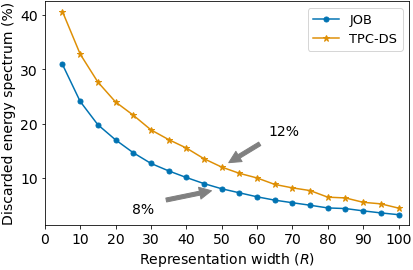

# Workload Modeling and Query Representation - Number of features per query (representation width)

Section 4.2.2 of our paper contains a detailed description of our workload modeling approach. In the following, we summarize and (sometimes literally) reproduce parts of this section. For workload representation, we build a *Bag Of Operators* (BOO) model that represents the physical operators that are relevant for index selection. Theoretically, this BOO representation could be directly included in the state (st). Since there are typically hundreds or thousands of relevant operators for the examined workloads, the BOO is high dimensional, leading to many sparsely populated features per query. Given that workloads often contain dozens of queries and that all of these queries would be represented by a BOO with hundreds of features, this approach seems unfeasible. Therefore, we apply a dimensionality reduction step for our workload model.

Based on the BOO representations of all representative query plans, we build a Latent Semantic Indexing (LSI) [1] model to reduce the feature count. Choosing the number of features that represent a query (the representation width `R` in the paper) is a tradeoff decision. Larger values for `R` increase the model’s size and can potentially affect the training times and model robustness due to many unstable values. On the other hand, smaller values of `R` might not be able to represent a query or workload sufficiently.

We employ the Gensim library [2] for building the LSI model. Measuring the amount of information loss (caused by reducing the representation width `R`) is, in general, a challenging problem. However, the Gensim library offers by default a measure (the *discarded energy spectrum* in Gensim terminology) that can indicate the amount of information loss. Thereby, the library supports us in determining an appropriate `R`-value by showing how much information is lost for a given target dimensionality (`R`). We conducted an experiment where we determined the information loss for different `R` values. The graph below shows the information loss (*discarded energy spectrum*) depending on these `R`-values for the TPC-DS and Join Order Benchmarks.

We use `R = 50` or the paper's evaluation section based on the experiments with different `R`-values. The corresponding information (JOB: 8%; TPC-DS: 12%) loss is marked with annotations in the figure. Even though the dimensionality reduction causes some information loss, the amount of loss seems reasonable considering that the agent's end-to-end performance did not improve further when we increased the representation width `R` further.

\[1\]: Deerwester et al.: *Indexing by Latent Semantic Analysis*. Journal of the American Society for Information Science, 1990.

\[2\]: [https://radimrehurek.com/gensim/index.html](https://radimrehurek.com/gensim/index.html)
